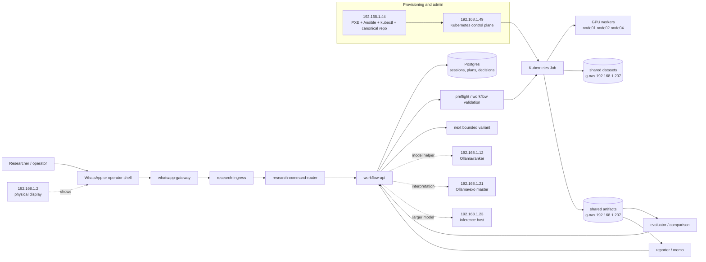

# Glasslab Infra And Workflow Display Report

This report is meant to feed a physical wall display or generated network
diagram for Glasslab. The focus is the intended system shape: machines,
services, data paths, and research workflows.

## Display Goal

The diagram should make Glasslab legible as a workflow platform rather than a
pile of machines.

The central story is:

1. an operator or researcher starts a bounded research session
2. Glasslab turns that session into an explicit plan
3. the plan is checked against available data, compute, and workflow rules
4. approved work runs as Kubernetes Jobs or Mac-hosted model calls
5. artifacts, metrics, comparisons, and reports return to the session
6. the next bounded experiment variant is proposed from the recorded evidence

## Main Workflow Loop

| Stage | User-facing idea | Owning component | Output |
| --- | --- | --- | --- |
| Intake | add a research goal, note, paper, or dataset | `whatsapp-gateway`, `research-ingress` | normalized request |
| Route | decide which deterministic command applies | `research-command-router` | backend action |
| Session | preserve state and current research context | `workflow-api`, Postgres | durable session record |
| Plan | create a bounded experiment or analysis plan | `workflow-api`, stage agents | reviewable plan |
| Check | validate inputs, resources, and workflow readiness | `workflow-api` | preflight result |
| Run | launch approved work | Kubernetes Jobs | run bundle |
| Store | persist source and run artifacts | g-nas NFS, MinIO where needed | artifact references |
| Compare | evaluate multiple completed runs | evaluator / workflow-api | comparison record |
| Report | produce a readable result memo | reporter / workflow-api | Markdown report |
| Decide | record the operator decision and next variant | workflow-api | next bounded mutation |

## Physical And Service Topology

| IP | Name | Intended role |
| --- | --- | --- |
| `192.168.1.44` | `glasslab-PXE-01` | PXE, TFTP, HTTP provisioning, bastion, Ansible, kubectl, canonical repo checkout |
| `192.168.1.49` | `cp01` | Kubernetes control plane |
| `192.168.1.48` | `node01` | Kubernetes worker and GPU candidate |
| `192.168.1.11` | `node02` | Kubernetes worker with RTX A4000 GPU |
| `192.168.1.50` | `node03` | Kubernetes worker |
| `192.168.1.51` | `node04` | Kubernetes worker with GTX 1060 GPU |
| `192.168.1.47` | `node05` | Kubernetes worker and service landing area |
| `192.168.1.207` | g-nas | NFS target for shared datasets and artifacts |
| `192.168.1.2` | `projector-san` | physical display endpoint |
| `192.168.1.12` | Mac service host | chat/ranker/coding-model target |
| `192.168.1.19` | Mac service host | exo worker |
| `192.168.1.21` | `CS60138N73111` | exo master and Ollama host |
| `192.168.1.23` | `CS60140N7311` | heavier Mac inference host |

## Core Glasslab Services

| Service | Placement | Role in workflow |
| --- | --- | --- |
| `glasslab-whatsapp-gateway` | `glasslab-v2` | receives operator messages and provider webhook events |
| `glasslab-research-ingress` | `glasslab-v2` | normalizes command and intake payloads |
| `glasslab-research-command-router` | `glasslab-v2` | maps user commands to deterministic backend actions |
| `glasslab-workflow-api` | `glasslab-v2` | owns sessions, plans, run creation, job submission, decisions, and artifact references |
| `glasslab-postgres` | `glasslab-v2` | durable workflow/session/state records |
| `glasslab-minio` | `glasslab-v2` | object-style source and artifact storage where useful |
| `glasslab-nats` | `glasslab-v2` | event/message substrate for asynchronous workflows |
| `glasslab-interpretation-agent` | `glasslab-v2` | interpretation-stage helper |
| `glasslab-intake-agent` | `glasslab-v2` | future structured intake helper |
| `glasslab-assessment-agent` | `glasslab-v2` | future assessment helper |
| `glasslab-design-agent` | `glasslab-v2` | future design-draft helper |
| `.12` Ollama | `192.168.1.12:11434` | coding notebook / bounded model target |
| `.12` ranker | `192.168.1.12:8181` | workflow-family ranking target when enabled |
| `.207` NFS | `192.168.1.207` | shared datasets and artifact persistence |

## Workflow Families To Show

The display should leave room for multiple workflow families, not only one
current experiment.

| Workflow family | Purpose | Execution shape |
| --- | --- | --- |
| `metric-search-v0` | metric-learning and representation-search experiments | GPU Kubernetes Job |
| validation run | small platform smoke and contract validation | bounded Kubernetes Job |
| literature/source intake | source collection and metadata normalization | workflow-api plus intake helpers |
| interpretation | turn sources or run outputs into structured claims | workflow-api plus model helper |
| reporting | make a deterministic human-readable memo | reporter / workflow-api |
| comparison | compare multiple completed run bundles | evaluator / workflow-api |

## Data And Artifact Paths

| Data class | Preferred home | Notes |
| --- | --- | --- |
| session records | Postgres | durable command and workflow state |
| source metadata | Postgres | paper/source records and provenance |
| source files | g-nas NFS or MinIO | PDFs, datasets, images, notebooks |
| run artifacts | g-nas NFS artifact PVC | run bundles under `/mnt/artifacts` |
| object-style payloads | MinIO | used when S3-style access is useful |
| model caches | local machine storage | keep performance-sensitive caches near compute |
| repo and manifests | `.44` plus GitHub | `.44` is the canonical live apply host |

## UML Display Sources

The projection-ready view is:

- `docs/display/glasslab-uml-display-2026-05-21.svg`

The UML source diagrams are:

- `docs/display/glasslab-infra-deployment-uml-2026-05-21.puml`
- `docs/display/glasslab-workflow-activity-uml-2026-05-21.puml`

The deployment diagram keeps the network graph visible. The activity diagram
adds the workflow path that can be traced on the whiteboard beneath the
projector.

## Legacy Mermaid Source

This Mermaid block is retained as a lightweight renderer-friendly source.

## Visual Encoding Recommendation

For a physical wall diagram:

- blue: command/control path
- green: durable state and artifacts
- purple: Mac-hosted model helpers
- orange: Kubernetes execution
- gray: provisioning/admin infrastructure
- red accent only for warnings or known gaps, not for normal machine roles
