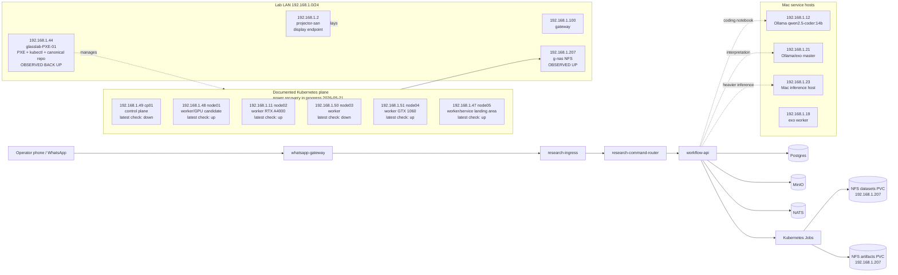

# Glasslab Infra Display Report: 2026-05-21

This report is meant to feed a physical wall display or generated network
diagram for Glasslab.

It records the state observed from the lab laptop at `192.168.1.36` on
2026-05-21 during recovery from a UPS/power failure. It deliberately separates
observed reachability from repo-declared intended roles.

Under normal lab operation, the expectation is that the PXE/provisioner host,
the Kubernetes control plane, all Kubernetes workers, the Mac service hosts,
the NAS, and the projector endpoint are up together. Temporary red/down states
in this document reflect the power recovery window, not the intended steady
state of Glasslab.

## Observed Now

Observed from the lab LAN:

| IP | Name | Observed state | Role |
| --- | --- | --- | --- |
| `192.168.1.100` | lab gateway | reachable | default route for lab LAN |
| `192.168.1.2` | `projector-san` | reachable | OptiPlex 990 projector machine, Xubuntu GUI, `lightdm` active |
| `192.168.1.12` | Mac service host | reachable by ping | documented OpenClaw/chat/ranker host |
| `192.168.1.19` | exo worker Mac | reachable by ping | documented exo worker, SSH key not accepted from this laptop during this check |
| `192.168.1.21` | `CS60138N73111` | reachable by SSH | exo master Mac, Ollama host |
| `192.168.1.23` | `CS60140N7311` | reachable by SSH | heavier Mac inference host |
| `192.168.1.207` | g-nas | reachable | NFS/shared storage target |
| `192.168.1.44` | `glasslab-PXE-01` | reachable by SSH after power returned | PXE/provisioner/canonical apply host |
| `192.168.1.47` | `node05` | reachable by ping from `.44` | Kubernetes worker in repo docs |
| `192.168.1.48` | `node01` | reachable by ping from `.44` | Kubernetes worker in repo docs |
| `192.168.1.49` | `cp01` | not reachable during latest check | Kubernetes control plane in repo docs |
| `192.168.1.50` | `node03` | not reachable during latest check | Kubernetes worker in repo docs |
| `192.168.1.51` | `node04` | reachable by ping from `.44` | Kubernetes worker in repo docs |
| `192.168.1.11` | `node02` | reachable by ping from `.44` | Kubernetes GPU worker in repo docs |

Implication:

- `.44` is back online after the UPS event, but the control plane at `.49` was
  still not reachable during the latest check.
- `kubectl` could not validate the live cluster because the API server endpoint
  is `https://192.168.1.49:6443`.
- The current physical display should show this as a power-recovery state: the
  expected normal state is fully up, but cluster validation is blocked until
  `cp01` returns.
- The projector machine itself is up and suitable as the wall-display endpoint.

## Normal Expected State

In the usual Glasslab state, these components should all be up:

| Plane | Expected state |
| --- | --- |
| PXE/provisioner | `.44` reachable by SSH, nginx/TFTP/dnsmasq available for PXE, canonical checkout present |
| Kubernetes control plane | `.49` reachable, API server listening on `:6443`, `kubectl` from `.44` works |
| Kubernetes workers | `.48`, `.11`, `.50`, `.51`, and `.47` reachable and `Ready` |
| Storage | `.207` reachable and NFS-backed shared dataset/artifact PVCs available |
| Mac service hosts | `.12`, `.19`, `.21`, and `.23` reachable for model/exo/helper services |
| Physical display | `.2` reachable with GUI display active |

## Current Display Endpoint

| Field | Value |
| --- | --- |
| IP | `192.168.1.2` |
| Hostname | `projector-san` |
| OS role | Xubuntu projector/display machine |
| Network | `eno1`, `192.168.1.2/24` |
| GUI state | `lightdm` active |
| Existing display asset | `/home/glasslab/Pictures/glasslab-network-topology.svg` |

## Intended Infra Roles From Repo

| IP | Name | Intended role |
| --- | --- | --- |
| `192.168.1.44` | `glasslab-PXE-01` | PXE, TFTP, HTTP provisioning, bastion, Ansible, kubectl, canonical repo checkout |
| `192.168.1.49` | `cp01` | Kubernetes control plane |
| `192.168.1.48` | `node01` | Kubernetes worker, documented GPU candidate |
| `192.168.1.11` | `node02` | Kubernetes worker, documented RTX A4000 GPU host |
| `192.168.1.50` | `node03` | Kubernetes worker |
| `192.168.1.51` | `node04` | Kubernetes worker, documented GTX 1060 GPU host |
| `192.168.1.47` | `node05` | Kubernetes worker, documented landing area for several v2 services |
| `192.168.1.207` | g-nas | NFS target for shared datasets and artifacts |
| `192.168.1.12` | Mac service host | documented OpenClaw/chat/ranker host |
| `192.168.1.21` | Mac service host | exo master and Ollama host |
| `192.168.1.19` | Mac service host | exo worker |
| `192.168.1.23` | Mac service host | heavier inference host |

## Intended Service Map From Repo

The repo currently defines the primary v2 command path as:

1. `whatsapp-gateway`
2. `research-ingress`
3. `research-command-router`
4. `workflow-api`
5. Kubernetes Jobs, artifacts, evaluation, reports

Repo-declared service relationships:

| Service | Namespace / host | Repo-declared role |
| --- | --- | --- |
| `glasslab-whatsapp-gateway` | `glasslab-v2` | WhatsApp/control-shell ingress |
| `glasslab-research-ingress` | `glasslab-v2` | command normalization and intake boundary |
| `glasslab-research-command-router` | `glasslab-v2` | deterministic command router |
| `glasslab-workflow-api` | `glasslab-v2`, pinned to `node05` in manifests | session state, run planning, job submission, artifact handoff |
| `glasslab-postgres` | `glasslab-v2` | durable workflow state |
| `glasslab-minio` | `glasslab-v2` | object-style artifact/source storage where needed |
| `glasslab-nats` | `glasslab-v2`, pinned to `node05` in manifests | event/message substrate |
| `glasslab-interpretation-agent` | `glasslab-v2` | interpretation-stage helper, configured against `.21` Ollama endpoint |
| `glasslab-intake-agent` | `glasslab-v2` | intake helper, currently disabled in workflow-api config |
| `glasslab-assessment-agent` | `glasslab-v2` | assessment helper, currently disabled in workflow-api config |
| `glasslab-design-agent` | `glasslab-v2` | design helper, currently disabled in workflow-api config |
| `.12` Ollama | `192.168.1.12:11434` | coding notebook model target in workflow-api config |
| `.12` ranker | `192.168.1.12:8181` | ranker target in workflow-api config, ranker currently disabled |
| `.207` NFS | `192.168.1.207` | `glasslab-shared-datasets` and `glasslab-shared-artifacts` backing store |

## Diagram Source

Use this Mermaid block as the source for an image generator or diagram renderer.

## Visual Encoding Recommendation

For a physical wall diagram:

- green: observed reachable now
- red: observed unreachable now
- amber: reachable but not fully validated
- blue: intended Kubernetes/service control path
- purple: external Mac model-service hosts
- gray dashed border: repo-declared but not live-validated
