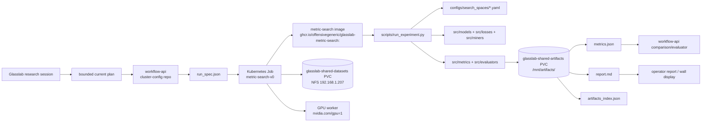

# Metric Search Display Report: 2026-05-21

This report summarizes the separate `glasslab-metric-search` project in a form
that can be rendered as a physical diagram next to the Glasslab infrastructure
map.

The metric-search repo observed on this laptop is:

- path: `/home/gr66ss/glasslab-metric-search`
- commit: `7c47fb1`
- working tree: untracked `.codex` and `scripts/inspect_run_metrics.py`

Operational note for 2026-05-21:

- the lab was in UPS/power-failure recovery during this documentation pass
- metric-search normally expects the Glasslab Kubernetes plane and GPU workers
  to be up
- at the latest infra check, `.44` was back but `cp01` was still down, so new
  metric-search Kubernetes jobs could not be validated until the API server
  returned

## Project Purpose

`glasslab-metric-search` is the workload-side project for contrastive
representation learning and metric-learning search.

Its current research target is:

- unseen-class generalization
- CIFAR-100 seen/unseen validation
- ArtBench-style metric-learning runs
- bounded mutation over metric-learning configuration

## Boundary Between Repos

| Repo | Owns |
| --- | --- |
| `glasslab-cluster-config` | sessions, run creation, Kubernetes scheduling, status, artifact indexing, comparison, reports |
| `glasslab-metric-search` | dataset bindings, model/loss/trainer/evaluator behavior, search spaces, candidate mutation logic |

The contract between them is the run spec emitted and consumed by the
metric-search runner.

## Metric Search Components

| Component | Path | Role |
| --- | --- | --- |
| configs | `configs/` | datasets, augmentations, search spaces, scheduler/loss config |
| runner scripts | `scripts/run_experiment.py`, `scripts/train.py`, `scripts/evaluate.py` | end-to-end run, training, evaluation |
| search logic | `search/` | run spec, validation, mutation, selection |
| data loaders | `src/data/` | CIFAR-100 and dataset handling |
| models | `src/models/` | backbone/model registry |
| losses | `src/losses/` | contrastive and proxy losses |
| miners | `src/miners/` | tuple/negative mining strategy |
| metrics | `src/metrics/` | grouped recall, OPIS, clustering metrics |
| evaluators | `src/evaluators/` | evaluation pipeline |
| benchmarks | `benchmarks/art_retrieval.py` | art retrieval benchmark helpers |
| container | `Dockerfile` | image boundary for Kubernetes jobs |

## Intended Runtime Shape

One metric-search candidate maps to one Kubernetes Job.

Expected job shape:

| Field | Value |
| --- | --- |
| namespace | `glasslab-v2` |
| workflow/workload ID | `metric-search-v0` |
| container | `ghcr.io/offensivegeneric/glasslab-metric-search:<commit_sha>` |
| command | `python3 scripts/run_experiment.py` |
| GPU | `nvidia.com/gpu: 1` |
| CPU request | about `8` |
| memory request | about `32Gi` |
| dataset mount | `glasslab-shared-datasets` PVC |
| artifact mount | `glasslab-shared-artifacts` PVC |
| artifact root | `/mnt/artifacts/<run_id>` |

## Run Spec Contract

Required run-spec fields:

- `run_id`
- `parent_run_id`
- `base_commit`
- `submitted_by`
- `workflow_family`
- `search_space_id`
- `dataset`
- `resources`
- `budget`
- `config`

Example resource shape:

```json
{
  "gpu_count": 1,
  "cpu_count": 8,
  "memory_gb": 32
}
```

## Artifact Contract

Each run should write:

- `run_spec.json`
- `run_manifest.json`
- `config.json`
- `metrics.json`
- `status.json`
- `report.md`
- `artifacts_index.json`
- `logs/runner.log`

## Current Evaluation Warning

The most important current scientific caveat from the metric-search notes is:

- successful smoke/infrastructure runs are not yet strong scientific evidence
- grouped recall needs a stricter gallery contract
- random embeddings scored too high in one recent small-gallery evaluation
- full or fixed-size gallery evaluation is needed before treating unseen-class
  generalization claims as meaningful

The current role of metric-search in Glasslab should be shown as:

- good golden GPU workload candidate
- useful for validating the run fabric and artifact contract
- not yet a validated scientific result pipeline

## Diagram Source

Use this Mermaid block as the source for an image generator or diagram renderer.



## Visual Encoding Recommendation

For the metric-search diagram:

- blue: Glasslab control-plane ownership
- green: metric-search repo/runtime ownership
- orange: run-spec contract boundary
- purple: GPU execution
- gray: artifact and dataset storage
- red badge: evaluation protocol caveat
