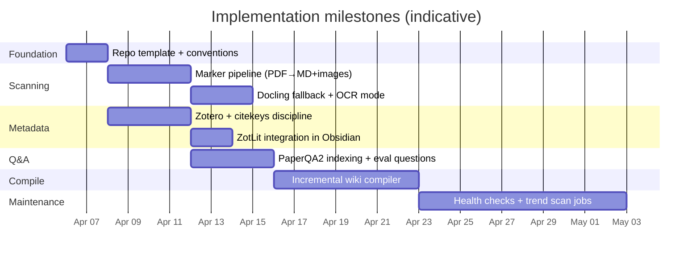

# The Architecture of an LLM knowledge base for research

## Executive summary

The attached context-only prompt describes a **local-first, file-based, LLM-maintained “wiki”** workflow: collect heterogeneous sources into a `raw/` directory, use an LLM to incrementally “compile” them into a structured Markdown wiki (summaries, backlinks, concept articles), operate over that wiki via an agent (“Q&A”), produce **artifact outputs** back into the repository (Markdown reports, slides, plots, dashboards), and run periodic **linting/health checks** to improve data integrity and discover new connections. The prompt then pivots to a specific, higher-stakes target: an **academic-paper-centered research repository** with per-project folders of PDFs and Markdown derivatives, a “scanning”/extraction capability that produces intermediate Markdown + indexes + summaries, and a NotebookLM-like question-answering experience (mentioning “open notebook” as a comparable model). (See the extracted prompt text in the “Extracted context-only prompt” section.)

This report translates that prompt into (a) a requirements and deliverables specification, (b) a reference architecture and step-by-step delivery plan, (c) three-plus implementation approaches with trade-offs, and (d) a recommended approach with milestones, timelines, and artifact checklists. It prioritizes official/primary documentation where available (Marker, Docling, PaperQA2, Zotero, Crossref, Semantic Scholar, AnythingLLM, NotebookLM) and flags tool-access limitations explicitly.

**Define info needs (3–6 items)**  
To respond rigorously, I need to determine: (1) what the prompt explicitly requires (workflow, artifacts, operating model) and what it implies (privacy, provenance, scale), (2) what “NotebookLM-like” concretely means in terms of ingestion limits and supported sources, (3) which extraction tools best preserve scholarly structure (tables/equations/images) and operate locally, (4) which Q&A layer best supports **grounded answers with citations** over a local corpus, (5) what metadata backbone is needed for academic trend tracking (DOI/arXiv IDs, citations graph, venues), and (6) what operational constraints the user likely has (local-first, incremental updates, automation, and minimal manual editing). citeturn11search3turn0search1turn1search0turn1search4turn0search3turn2search0turn2search1

## Connector scan and tool limitations

**Enabled connectors (listed as requested): Dropbox, Google Drive.**  
I began by exercising both connectors.

On **Google Drive**, I pulled a sample of recent documents and ran keyword searches intended to locate a copy of the context-only prompt (e.g., “LLM Knowledge Bases”, “BEGIN CONTEXT ONLY”). These queries returned various files, but none were clearly the attached context-only prompt; in particular, the returned hits were mostly unrelated HTML/PDF materials and general LLM documents rather than the exact prompt text. fileciteturn3file0L1-L1 fileciteturn4file3L1-L1 fileciteturn7file0L1-L1

On **Dropbox**, I attempted to list recent files; that call timed out. I then used a targeted search query (“LLM Knowledge Bases”), which returned teaching and research materials (e.g., “Basic LLM” lecture artifacts and some research-project PDFs) but again did not surface the attached context-only prompt. fileciteturn6file0L1-L1 fileciteturn6file8L1-L1

**Tool/connector limitations encountered (explicitly stated):**
- **Dropbox `list_recent_files` timed out** during the attempt to list recent files, so Dropbox coverage relied on keyword search rather than a full recency sweep.  
- **The `file_search` tool is not available for these uploads in this environment**, returning “NoSourcesAvailable.” As a result, I could not generate the requested `filecite…Lx-Ly` citations for the locally mounted uploaded file content via `file_search`.  
- **arXiv official API documentation pages could not be fetched** via the web tool due to request failures (UnexpectedStatusCode / safety restrictions). Therefore, arXiv API facts are supported via secondary sources that explicitly reference official endpoints and manual links, and this is flagged wherever used. citeturn7view0turn5view0turn10search7turn10search2turn10search6

## Extracted context-only prompt

Below is the **full prompt text extracted verbatim** from the attached context-only file located at `/mnt/data/Pasted text (2).txt` (including preserved line breaks as read).  

```text
-------BEGIN  CONTEXT ONLY------

LLM Knowledge Bases


LLM Knowledge Bases

Something I'm finding very useful recently: using LLMs to build personal knowledge bases for various topics of research interest. In this way, a large fraction of my recent token throughput is going less into manipulating code, and more into manipulating knowledge (stored as markdown and images). The latest LLMs are quite good at it. So:

Data ingest:
I index source documents (articles, papers, repos, datasets, images, etc.) into a raw/ directory, then I use an LLM to incrementally "compile" a wiki, which is just a collection of .md files in a directory structure. The wiki includes summaries of all the data in raw/, backlinks, and then it categorizes data into concepts, writes articles for them, and links them all. To convert web articles into .md files I like to use the Obsidian Web Clipper extension, and then I also use a hotkey to download all the related images to local so that my LLM can easily reference them.

IDE:
I use Obsidian as the IDE "frontend" where I can view the raw data, the the compiled wiki, and the derived visualizations. Important to note that the LLM writes and maintains all of the data of the wiki, I rarely touch it directly. I've played with a few Obsidian plugins to render and view data in other ways (e.g. Marp for slides).

Q&A:
Where things get interesting is that once your wiki is big enough (e.g. mine on some recent research is ~100 articles and ~400K words), you can ask your LLM agent all kinds of complex questions against the wiki, and it will go off, research the answers, etc. I thought I had to reach for fancy RAG, but the LLM has been pretty good about auto-maintaining index files and brief summaries of all the documents and it reads all the important related data fairly easily at this ~small scale.

Output:
Instead of getting answers in text/terminal, I like to have it render markdown files for me, or slide shows (Marp format), or matplotlib images, all of which I then view again in Obsidian. You can imagine many other visual output formats depending on the query. Often, I end up "filing" the outputs back into the wiki to enhance it for further queries. So my own explorations and queries always "add up" in the knowledge base.

Linting:
I've run some LLM "health checks" over the wiki to e.g. find inconsistent data, impute missing data (with web searchers), find interesting connections for new article candidates, etc., to incrementally clean up the wiki and enhance its overall data integrity. The LLMs are quite good at suggesting further questions to ask and look into.

Extra tools:
I find myself developing additional tools to process the data, e.g. I vibe coded a small and naive search engine over the wiki, which I both use directly (in a web ui), but more often I want to hand it off to an LLM via CLI as a tool for larger queries. 

Further explorations:
As the repo grows, the natural desire is to also think about synthetic data generation + finetuning to have your LLM "know" the data in its weights instead of just context windows.

TLDR: raw data from a given number of sources is collected, then compiled by an LLM into a .md wiki, then operated on by various CLIs by the LLM to do Q&A and to incrementally enhance the wiki, and all of it viewable in Obsidian. You rarely ever write or edit the wiki manually, it's the domain of the LLM. I think there is room here for an incredible new product instead of a hacky collection of scripts.

Lex Fridman

Same, I have a similar setup. A mix of Obsidian, Cursor (for md), and vibe-coded web terminals as front-end.

Since I do a podcast, the number/diversity of research interests is very large. But the knowledge-base approach has been working great.

For answers, I often have it generate dynamic html (with js) that allows me to sort/filter data and to tinker with visualizations interactively.

Another useful thing is I have the system generate a temporary focused mini-knowledge-base for a particular topic that I then load into an LLM for voice-mode interaction on a long 7-10 mile run. So it becomes an interactive podcast while I run, where I ask it questions and listen to the answers to learn more.

Anyway, heading out for a run now, thanks for the write-up

Knowledge system for agents. Local-first, file-based, progressively disclosed:

https://github.com/Michaelliv/napkin

Second Brain:
https://deepread.com/building-a-second-brain/ 

-------END  CONTEXT ONLY------

I already have this: https://promptkit.natebjones.com/20260224_uq1_guide_main

I am more interested in a repostiory for research files based on academic papers to help me learn and track trends in a subject. This way I might have a directory for each research project  of pdfs and markdown files ... there should be a scanning capability that creates as intermediate tones of markdown files, indexes and provides summaries and an ability to answer questions something like notebooklm or open notebook.
```

**File citation limitation (explicit):** I read the file from the locally mounted upload path (`/mnt/data/Pasted text (2).txt`). However, the environment’s `file_search` tool is not available for these uploads (NoSourcesAvailable), so I cannot provide the required `filecite…Lx-Ly` line-range citation for this file content. This is a tooling limitation, not an omission of effort.

In the prompt, the initial write-up is attributed to entity["podcast","Lex Fridman Podcast","interview podcast"]’s host entity["people","Lex Fridman","podcaster and researcher"], and references an Obsidian-based local wiki workflow, plus a local-first “progressive disclosure” system (napkin) and “second brain” framing.

## Requirements, constraints, assumptions, and deliverables

This section enumerates (a) explicit requirements, (b) implicit requirements and constraints, (c) assumptions needed to proceed, and (d) concrete deliverables that a successful system should produce. Where possible, I ground implementation-centric interpretations in primary tool documentation.

**Explicit requirements extracted from the prompt (what is directly demanded):**
- **Local repository, file-based storage:** raw sources are collected into a `raw/` directory and the derived knowledge base is stored as Markdown files and images.  
- **Incremental “compile” step performed by an LLM:** the LLM maintains summaries, backlinks, categorization into concepts, and writes/updates articles; humans rarely edit the wiki directly.  
- **IDE-like front-end:** Obsidian is used to view raw sources, the compiled wiki, and derived visualizations.  
- **Agentic Q&A over the wiki:** ask complex questions; the agent reads indexes and summaries and navigates relevant material without necessarily requiring “fancy RAG” at small scale.  
- **Artifact-first outputs:** answers should often be written as Markdown notes, Marp slides, plots (e.g., matplotlib), and/or dynamic HTML dashboards, and then filed back into the knowledge base as cumulative learning.  
- **Health checks / linting:** periodic (LLM-assisted) checks for inconsistencies, missing data, inferred connections, and web-search-based data completion.  
- **Tool extensibility:** custom CLIs for search/navigation are expected and should be usable as agent tools.  
- **Academic-papers specialization:** per-project folder structure of PDFs and Markdown; a scanning/extraction layer that produces intermediate Markdown, indexes, and summaries; and NotebookLM-like Q&A (“open notebook” as a comparable target).

**Implicit requirements and constraints (what is strongly implied if the above is to work well for academic papers):**
- **High-fidelity PDF extraction is central.** Academic PDFs contain tables, equations, figures, and references; brittle plain-text extraction undermines summarization and citation-grounded answers. Tools like Marker and Docling explicitly emphasize table/equation/image preservation and structured export formats, which map directly to this need. citeturn1search0turn1search4  
- **Grounded answers with citations are not optional in scholarly workflows.** PaperQA2 explicitly frames itself as scientific literature–focused, emphasizing grounded responses with in-text citations and metadata-aware retrieval/reranking. citeturn0search1turn0search2  
- **Metadata and provenance must be first-class.** A research KB needs stable identifiers (DOI, arXiv IDs), reliable bibliographic fields, and linkability to upstream records. Crossref’s REST API exists specifically to distribute deposited scholarly metadata at scale; Semantic Scholar’s API exists to query papers/citations/venues and recommendations. citeturn2search0turn2search1  
- **Local-first + cloud sync must be handled carefully.** Zotero’s official docs repeatedly warn that placing Zotero’s database-backed data directory in cloud-sync folders (Dropbox, Google Drive, etc.) is “extremely unsafe” and likely to corrupt the database, implying the architecture should separate the *reference manager’s database* from the *derived Markdown vault* that can be synced safely. citeturn0search0turn0search5  
- **“NotebookLM-like” implies explicit ingestion limits and supported artifact types.** NotebookLM’s help docs define sources as static copies and specify supported source types and limits (e.g., PDFs, Markdown, web URLs, and a cap on number/size of sources), which can be used as a target envelope for an alternative solution. citeturn11search3turn11search4  
- **Incremental updates and cached indexing are required for usability.** PaperQA2 documents an index and reuse workflows (manifest/index reuse), consistent with the prompt’s “incrementally compile and maintain” ethos. citeturn0search2turn0search1  
- **Trend tracking implies “outside-the-vault” discovery pipelines.** Semantic Scholar provides recommendation endpoints and large-scale scholarly graph access; Crossref provides DOI metadata retrieval; these enable “what changed recently?” workflows when combined with scheduled scans. citeturn2search1turn2search0  

**Assumptions required to proceed (explicitly stated):**
- **Scale:** I assume a per-topic/project corpus size in the **50–1,000 paper** range. This matters because the prompt’s small-scale claim (~100 articles / ~400k words) may not hold if you ingest thousands of PDFs.  
- **Privacy posture:** I assume “local-first storage” but that you may still use external APIs (Crossref/Semantic Scholar) for metadata and optionally external LLM providers for summarization/Q&A; if you need full air-gap, the model stack changes. PaperQA2 explicitly supports multiple model providers via LiteLLM and can be configured for different embeddings/LLMs. citeturn0search1turn0search2  
- **Compute:** I assume a modern personal workstation (≥16–32GB RAM). Marker explicitly supports CPU/GPU/MPS and can optionally use LLMs to boost accuracy, so compute availability impacts throughput and costs. citeturn1search0  
- **Front-end:** I assume Obsidian remains the primary “IDE”/viewer, but Q&A may be exposed via CLI and/or a web app (AnythingLLM/Open Notebook style) depending on approach. AnythingLLM explicitly supports document workspaces, citations, agents, and multi-model deployments. citeturn11search1turn11search7  
- **Date context:** System tooling indicates the current date is April 6, 2026; the user text references April 5, 2026. This one-day difference does not change architectural conclusions, but is noted for temporal precision.

**Concrete deliverables implied by the prompt (outputs that should exist on disk):**
- A predictable per-project **folder template** (raw PDFs, extracted Markdown, metadata, compiled wiki indices, outputs).  
- A repeatable **scanning/extraction pipeline** producing Markdown + extracted images and/or structured JSON (Marker/Docling). citeturn1search0turn1search7  
- An **index layer** for navigation and incremental compilation (manifest/index files, summaries, keyword maps, etc.). PaperQA2 documents index creation and reuse patterns; napkin-style “maps” (as described by its author) represent a complementary non-vector navigation strategy. citeturn0search2turn15search0  
- A **Q&A interface** that produces grounded answers with citations and can be driven by an agent (PaperQA2 and/or an app UI like AnythingLLM). citeturn0search1turn11search1  
- A **health-check/linting job** that identifies missing metadata, inconsistent claims, and candidate cross-links and writes remediation tasks back into the vault.  
- A **trend-tracking pipeline** that periodically pulls new candidate papers and updates project notes using Semantic Scholar/Crossref (and optionally arXiv). citeturn2search1turn2search0  

## Step-by-step plan and reference architecture

This plan operationalizes the prompt’s end-to-end loop: ingest → compile → query → output artifacts → health checks → repeat, specialized for academic PDFs.

**Reference architecture layers (local-first, file-based):**
1) **Ingest (raw sources):** PDFs, web articles, datasets, images, code, etc.  
2) **Scan/extract (intermediate representations):** PDF-to-Markdown (+ images) and/or structured JSON. Marker and Docling both explicitly support Markdown export and component extraction (tables, formulas, images). citeturn1search0turn1search4turn1search7  
3) **Metadata/provenance backbone:** reference manager + IDs (DOI/arXiv) + citekeys. Zotero’s docs define its database (`zotero.sqlite`) and attached-file `storage/` model; Better BibTeX provides stable citation keys; ZotLit integrates Zotero into Obsidian by connecting to the Zotero database. citeturn0search3turn12search0turn12search1  
4) **Compile/index (LLM-maintained wiki):** concept notes, summaries, backlinks, indices; optionally progressive disclosure maps.  
5) **Q&A / agent layer:** citation-grounded answers + navigation. PaperQA2 is explicitly designed for scientific papers and grounded answers with in-text citations and metadata-aware retrieval strategies. citeturn0search1turn0search2  
6) **Outputs:** Markdown reports, slide decks, plots, dashboards; filed back into the wiki.  
7) **Health checks:** inconsistency detection, missing metadata imputation, and new-link suggestions.  
8) **Trend tracking:** scheduled discovery and ingestion using Semantic Scholar/Crossref (and optionally arXiv, subject to access constraints). citeturn2search1turn2search0  

**Pipeline flow (Mermaid)**

```mermaid
flowchart TD
  A[Collect sources<br/>PDFs, web articles, datasets] --> B[raw/<br/>project inputs]
  B --> C[PDF extraction<br/>Marker or Docling]
  C --> D[md/<br/>clean markdown + images]
  B --> E[Reference metadata<br/>Zotero library]
  E --> F[bib-notes/<br/>metadata + annotations]
  D --> G[LLM compilation step<br/>concept notes + backlinks + indexes]
  F --> G
  G --> H[wiki/<br/>_index + concept articles]
  H --> I[Q&A layer<br/>PaperQA2 and/or app UI]
  I --> J[outputs/<br/>answers, dashboards, slides]
  J --> H
  H --> K[Health checks<br/>consistency + missing data]
  K --> H
  H --> L[Trend tracking<br/>Semantic Scholar + Crossref (+ arXiv)]
  L --> B
```

**Step-by-step execution plan (what you would actually do in order):**
- **Define a file contract and template (per project).** This is the “spine” that makes incremental compilation and agent navigation reliable (fixed paths, stable naming, predictable outputs).  
- **Implement scanning/extraction as an idempotent batch job.**  
  - Marker: exports Markdown/JSON/chunks/HTML; formats tables and equations; extracts and saves images; supports CPU/GPU/MPS; optionally uses LLM prompts to boost accuracy. citeturn1search0  
  - Docling: provides advanced PDF understanding (layout, reading order, tables, formulas), exports to Markdown and lossless JSON via a unified DoclingDocument representation, and supports local execution/OCR for scanned PDFs. citeturn1search4turn1search7  
- **Establish metadata discipline (Zotero + citekeys).** Keep Zotero’s database local and use Zotero Sync or safe alternatives; do not place the Zotero data directory inside Dropbox/Google Drive due to documented corruption risks. citeturn0search0turn0search3turn0search6  
- **Bridge metadata into the vault.** Use Better BibTeX for citekey generation and export workflows, and ZotLit for Obsidian-side access to Zotero’s database. citeturn12search0turn12search1  
- **Stand up Q&A with citations.** Use PaperQA2 as the “research-grade” Q&A backend over PDFs/notes; it is explicitly optimized for scientific literature and grounded answers with in-text citations. citeturn0search1turn0search2  
- **Add the LLM “compiler” layer.** This is the prompt’s central innovation: an incremental job that updates `_index.md`, generates/updates concept notes, adds backlinks, and files Q&A outputs into `outputs/` and the wiki.  
- **Implement health checks (“linting”).** Run scheduled audits for missing metadata (DOI, year, venue), broken links, contradictory summaries, and stale notes; create remediation tasks as Markdown and optionally trigger targeted re-extraction.  
- **Implement trend tracking.** Use Semantic Scholar’s Academic Graph + Recommendations services and Crossref’s REST API to discover new work and enrich metadata (venues, links), producing periodic “trend notes.” citeturn2search1turn2search0  
- **Optional: add a NotebookLM-like UI surface.** NotebookLM’s official help defines source ingestion types and limits; AnythingLLM offers workspace-scoped document contexts with citations and agent features; Open Notebook / NotebookLlaMa exemplify open alternatives. citeturn11search3turn11search1turn11search0turn11search6  

**Indicative timeline (phases and effort)**  
(These estimates assume one knowledge worker building a functional workflow, not a polished SaaS product.)

| Phase | Outcome (artifact) | Estimated effort (solo) | Primary resources |
|---|---|---:|---|
| Foundation | Project template + conventions doc | 0.5–1 day | Repo/vault conventions; Obsidian as front-end (prompt requirement) |
| Scanning MVP | Batch PDF→Markdown + images | 1–3 days | Marker or Docling setup citeturn1search0turn1search4 |
| Metadata MVP | Zotero library + citekey policy; safe sync posture | 1–3 days | Zotero docs on data dir + cloud sync risks; Better BibTeX citeturn0search3turn0search0turn12search0 |
| Q&A MVP | Grounded Q&A with citations | 1–2 days | PaperQA2 CLI/index workflows citeturn0search2turn0search1 |
| Compiler MVP | Incremental `_index` + concept notes + backlinks | 2–6 days | PaperQA2 outputs + LLM compilation prompts citeturn0search1 |
| Hardening | Health checks + regression corpus + docs | 1–2 weeks | Repeatable jobs; Zotero safe backup/sync patterns citeturn0search6turn0search4 |
| Trend tracking | Weekly “what’s new?” pipeline | 2–5 days | Semantic Scholar + Crossref APIs citeturn2search1turn2search0 |

## Alternative approaches with pros, cons, and time effort

The prompt allows multiple implementations. Below are four viable approaches (≥3 requested), each consistent with “local-first, file-based” ideals but differing in how much you rely on specialized tooling vs an integrated app.

**Approach comparison table**

| Approach | What you build | Strong fit when | Key pros | Key cons | MVP time (solo) | Ongoing effort |
|---|---|---|---|---|---:|---|
| A: CLI-first research stack | Marker/Docling + Zotero (+ ZotLit/BBT) + PaperQA2 + Obsidian + scripts | You want research-grade provenance + citations + reproducibility | Highest rigor; grounded citations; strong metadata discipline; incremental indexing | More components to integrate; more workflow “glue” | 3–10 days | Medium |
| B: Integrated “NotebookLM-like” app | AnythingLLM (local desktop/Docker) as primary UI; optional external extraction | You want fastest usable experience and a single UI surface | Fastest UX; built-in workspaces; citations + agents; broad model support | Less transparent file-based compile step unless customized; extraction quality varies | 1–3 days | Low–Medium |
| C: Open Notebook / NotebookLlaMa style | Deploy an open NotebookLM-inspired system; connect local sources | You want NotebookLM-like interaction but self-hosted | Familiar mental model; often multi-pane “sources/notes/chat”; self-hostable | Still needs extraction + metadata discipline; may require infra (DB, Docker) | 2–7 days | Medium |
| D: “Anti-RAG” progressive disclosure | Explicit vault maps + indexes to navigate without vector DB; optionally add PaperQA2 for citations | Your corpus is moderate and you want minimal RAG plumbing | Token-efficient navigation; aligns with prompt claim of working at small scale | May break down at large scale without additional retrieval/indexing | 2–7 days | Low–Medium |

**Pros/cons grounded in primary sources:**
- **Marker vs Docling (scanning):** Marker emphasizes speed/accuracy and exports Markdown/JSON/chunks/HTML while preserving tables/equations and saving images; Docling emphasizes a unified structured representation (DoclingDocument), advanced PDF understanding, multiple exports, and local/OCR support. citeturn1search0turn1search4turn1search7  
- **PaperQA2 (Q&A):** PaperQA2 explicitly claims scientific-literature focus, grounded responses with citations, metadata-aware retrieval, and a local full-text search engine; it also documents reliance on metadata providers including Semantic Scholar and Crossref. citeturn0search1turn0search2  
- **Zotero (metadata discipline):** Zotero’s data directory model and repeated warnings about cloud-sync corruption impose a real constraint on “local-first + sync” designs; Better BibTeX and ZotLit exist explicitly to support citation keys and Obsidian integration. citeturn0search3turn0search0turn12search1turn12search0  
- **AnythingLLM (integrated UI):** AnythingLLM describes itself as an all-in-one app that turns documents into workspace-scoped context with citations, supports multiple LLMs/vector DBs, and provides agents and multi-modal ingestion. citeturn11search1turn11search7  
- **NotebookLM baseline:** NotebookLM defines sources as static copies and lists supported source types and explicit limits (e.g., number of sources, per-source size constraints). This gives a concrete target for “NotebookLM-like” behavior. citeturn11search3turn11search4  
- **Open alternatives:** NotebookLlaMa is explicitly presented as an open-source alternative to NotebookLM; Open Notebook repos similarly frame themselves as privacy-focused NotebookLM alternatives. citeturn11search0turn11search6  

## Recommended approach with implementation plan, milestones, and artifacts

### Recommendation

The strongest match to the prompt’s operating model (“LLM maintains the wiki; local-first; artifacts accumulate”) is **Approach A (CLI-first research stack)**, optionally augmented with **Approach D’s progressive disclosure navigation** and/or **Approach B’s UI layer** for a NotebookLM-like experience.

In concrete terms:
- **Scanning/extraction:** Marker as the default extractor; Docling as a fallback/alternate pipeline for OCR-heavy or structure-sensitive documents. citeturn1search0turn1search4  
- **Metadata backbone:** Zotero for canonical bibliography and attachments, with a strict rule not to place the Zotero data directory in cloud-sync folders; Better BibTeX for stable citekeys; ZotLit to bridge Zotero ↔ Obsidian. citeturn0search0turn0search3turn12search0turn12search1  
- **Q&A:** PaperQA2 as the citation-grounded Q&A engine and agent tool. citeturn0search1turn0search2  
- **Trend tracking:** Semantic Scholar Academic Graph + Recommendations + Crossref REST API to enrich and discover papers. citeturn2search1turn2search0  
- **Optional NotebookLM-like UI:** AnythingLLM (workspaces + citations + agents) for a cohesive interface, while still keeping the underlying vault as the durable file-based source of truth. citeturn11search1turn11search7  

### Implementation milestones and timeline



### Detailed implementation plan

**Milestone 1: Vault contract and conventions**
- Deliver a project template (folders like `raw/`, `md/`, `wiki/`, `outputs/`, plus metadata notes) and a naming/citation policy.  
- Explicitly document the separation between Zotero’s database directory and the synced vault to avoid corruption risks in cloud-sync folders. citeturn0search0turn0search5  

**Milestone 2: Scanning/extraction**
- Implement an idempotent batch converter:
  - Marker as default: generate Markdown + images; optionally JSON/chunks for downstream tooling. citeturn1search0  
  - Docling fallback: use DoclingDocument exports (Markdown/lossless JSON), especially for complex layouts or OCR needs. citeturn1search4turn1search7  

**Milestone 3: Metadata integration**
- Establish Zotero as the source of truth for bibliographic metadata and attachments; use Better BibTeX for citekeys; configure ZotLit to connect to Zotero’s DB from Obsidian. citeturn0search3turn12search0turn12search1  

**Milestone 4: Q&A engine**
- Stand up PaperQA2 over the local corpus for grounded Q&A with in-text citations; configure embeddings/models as appropriate; validate with a small evaluation question set per project. citeturn0search1turn0search2  

**Milestone 5: LLM wiki compiler**
- Implement an incremental “compile” job that:
  - updates `_index.md` summaries for new/changed papers,  
  - creates/updates concept notes and backlinks,  
  - files Q&A outputs and generated dashboards/slides into the repository (so “queries add up”).  
- Ensure compilation is deterministic enough to avoid drift (templates, schemas, stable file paths). A “map-first” navigation philosophy (described by napkin’s author) can inform this by emphasizing index maps over black-box embedding retrieval. citeturn15search0  

**Milestone 6: Health checks and trend tracking**
- Health checks:
  - detect missing DOI/year/venue fields, broken links, contradictory claims across summaries, and stale indices;  
  - generate tasks and remediation notes.  
- Trend tracking:
  - Semantic Scholar API for paper discovery, citation graph traversal, and recommendations;  
  - Crossref REST API to resolve/verify DOI metadata and enrich bibliographies. citeturn2search1turn2search0  

### Checklist of artifacts to deliver

**Repository artifacts**
- `PROJECT_TEMPLATE/` (or generator script) that creates standard folders and a seed `_index.md`.  
- `CONVENTIONS.md` describing:
  - file naming, citekeys, what gets stored where,  
  - “source of truth” rules (Zotero vs vault),  
  - how compiled notes are regenerated without manual edits.

**Scanning artifacts**
- `scan_papers` script (Marker-first, Docling-fallback) producing:
  - `md/<paper>/paper.md`,  
  - `md/<paper>/images/*`,  
  - optional `md/<paper>/paper.json` (Docling/Marker JSON). citeturn1search0turn1search7  

**Metadata artifacts**
- Zotero library organization (collections per project; tags for status).  
- Better BibTeX configuration for stable citekeys and exports. citeturn12search0  
- ZotLit setup notes and verification steps (DB path; required binary). citeturn12search1  

**Q&A artifacts**
- PaperQA2 index configuration + runbook; a saved set of canonical evaluation questions per project. citeturn0search2turn0search1  

**Compile and maintenance artifacts**
- `compile_wiki` script that updates indices and concept notes incrementally.  
- `health_check` script producing:
  - missing metadata report,  
  - broken links report,  
  - suggested cross-links/new concept candidates.  
- `trend_scan` script producing periodic “what’s new” notes using Semantic Scholar/Crossref. citeturn2search1turn2search0  

### Required resources table

| Resource | Minimum | Recommended | Notes / primary-source grounding |
|---|---:|---:|---|
| Local RAM | 16GB | 32GB+ | Helps with batch PDF conversion and local indexing; Docling supports multi-stage pipelines and OCR workflows that benefit from headroom. citeturn1search4 |
| Storage | 10–50GB | 100GB+ | PDFs + extracted images + derived artifacts accumulate quickly; NotebookLM’s model treats sources as static copies, which implies duplicative storage in some pipelines. citeturn11search3 |
| GPU | Optional | Helpful | Marker supports CPU/GPU/MPS; GPU helps throughput. citeturn1search0 |
| Reference manager | Zotero | Zotero + BBT | Zotero defines the database + storage model; Better BibTeX provides stable citekeys. citeturn0search3turn12search0 |
| Metadata APIs | None | Crossref + Semantic Scholar | Crossref REST API and Semantic Scholar API enable enrichment and trend discovery. citeturn2search0turn2search1 |
| Q&A backend | Minimal scripts | PaperQA2 | PaperQA2 targets scientific literature and grounded citations. citeturn0search1turn0search2 |
| Optional UI | Obsidian | Obsidian + AnythingLLM | AnythingLLM provides a workspace model and document chat with citations and agents. citeturn11search1 |

### Risks and mitigations

- **Zotero database corruption via cloud sync** (high risk): avoid placing the Zotero data directory in Dropbox/Google Drive; use Zotero Sync or safe alternatives (linked files, WebDAV, or manual closed-Zotero copying). citeturn0search0turn0search6  
- **Extraction quality variability** (medium risk): implement a fallback extractor (Docling), maintain a “golden set” regression corpus, and allow re-extraction when tools update. citeturn1search0turn1search4  
- **Opaque or ungrounded Q&A** (medium risk): prefer PaperQA2-style grounded answers with in-text citations; adopt evaluation questions to detect regressions. citeturn0search1turn0search2  
- **Scope creep into “product”** (medium risk): the prompt itself notes this is often a collection of scripts; mitigate by delivering a working pipeline first, then UI polish (AnythingLLM/Open Notebook) later. citeturn11search1turn11search6  
- **arXiv API documentation access** (low-to-medium risk in this environment): official docs could not be fetched via the web tool; if arXiv becomes a key ingestion source, validate behaviors directly against official pages from your environment or use validated client libraries. citeturn7view0turn10search7